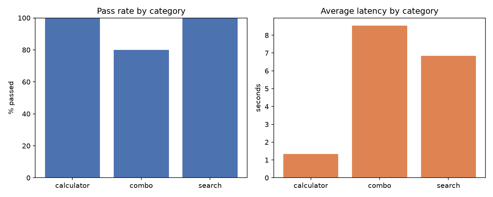

[](https://github.com/WAD3n/Agent/actions/workflows/ci.yml)
[](https://github.com/WAD3n/Agent/actions/workflows/e2e.yml)

# AI Agent with Evaluation

A small tool-calling AI agent (LangGraph + Groq) that decides on its own whether
to search the web, use a calculator, or answer directly — with a measured
evaluation layer (accuracy, steps, token cost, latency) instead of just a demo
that "works."

> Live demo: _not deployed yet_

## How it works

```text
                 ┌────────────────┐
   user question │                │
   ───────────►  │     reason     │◄───────────────────┐
                 │  (LLM decides) │                    │
                 └───────┬────────┘                    │
                         │                             │
                         ▼                             │
                  wants a tool call?                   │
                    and under step limit?              │
                         │                             │
             ┌───────────┴───────────┐                 │
             │ yes                   │ no              │
             ▼                       ▼                 │
     ┌─────────────────┐        final answer           │
     │   call_tools    │           (END)               │
     │ (run the tool)  │                               │
     └───────┬─────────┘                               │
             │ tool result fed back as a new message   │
             └─────────────────────────────────────────┘
```

The LLM re-decides at every step — there's no fixed pipeline order. It can
call a tool, call a different tool, or stop and answer, up to a hard limit of
5 iterations (the last iteration always forces a final answer instead of
letting a tool call cut it off mid-way).

## Design decisions

- **Agent framework: LangGraph.** A plain function-calling loop would work
  with only 3 tools, but LangGraph is the more transferable pattern to show.
- **LLM: Groq**, free tier, native tool-use support. Model is selectable per
  request (default `openai/gpt-oss-120b`) — see [Model selection](#model-selection).
- **Search: Tavily**, free tier (1000 credits/month).
- **Calculator: [asteval](https://github.com/newville/asteval)**, not raw
  `eval()` — sandboxed expression evaluation, no code-injection surface.
- **Knowledge base: DuckDB + the `vss` extension** (HNSW vector index),
  Gemini embeddings. _Not implemented yet_ — corpus ingestion is pending.
- **UI: Streamlit**, minimal question/answer interface with a decision-trace
  panel, deployed for free on Streamlit Community Cloud.

## Tools

| Tool | Purpose | Notes |
|---|---|---|
| `web_search` | Current/factual info | Tavily |
| `calculator` | Arithmetic | `asteval`, sandboxed |
| `knowledge_base_search` | Curated corpus retrieval | scaffolded, not ingested yet |

## Model selection

The Groq model isn't hardcoded — it's part of the agent's state, so it can be
picked per request:

- **Web UI**: dropdown above the question field.
- **CLI**: `python cli.py --model openai/gpt-oss-20b`.
- **Code**: `run_agent(question, model="...")`.

Available models (`agent.graph.AVAILABLE_MODELS`), all chat/tool-use capable
on the free Groq tier:

| Model | Notes |
|---|---|
| `openai/gpt-oss-120b` | default, best tool-use reliability in testing |
| `openai/gpt-oss-20b` | smaller/faster, sometimes skips tools it should use |
| `openai/gpt-oss-safeguard-20b` | safety-tuned variant |
| `qwen/qwen3.6-27b` | |
| `groq/compound` | Groq's own agentic/compound model |
| `groq/compound-mini` | |
| `allam-2-7b` | |

## Evaluation

`eval/run_eval.py` runs 18 tasks across three categories (calculator,
search, combo) against the live agent, grades each answer (exact-match for
numeric answers, LLM-as-judge for free-text search answers), and logs
steps/tokens/latency to `eval/results.duckdb`.

Latest run: **17/18 passed (94%)**

| category | passed | avg steps | avg tokens | avg latency |
|---|---|---|---|---|
| calculator | 7/7 | 1.9 | 616 | 1.33s |
| search | 6/6 | 1.5 | 1603 | 6.84s |
| combo | 4/5 | 1.6 | 1130 | 8.54s |



The one failure (`combo-1`) is a genuine factual mistake by the model (wrong
founding year for Anthropic), not an eval bug — exactly the kind of thing
this layer is meant to catch.

## Running locally

```bash
pip install -r requirements.txt
cp .env.example .env   # fill in GROQ_API_KEY, TAVILY_API_KEY

python cli.py          # terminal harness with a full decision trace
streamlit run app.py   # web UI
python -m eval.run_eval  # re-run the evaluation suite
```

Unit tests (mocked LLM, no API calls) run on every push via CI:

```bash
pytest
```

End-to-end tests (real Groq/Tavily calls) run manually or once a day via a
separate GitHub Actions workflow:

```bash
pytest -m e2e
```

## Project structure

```
agent/            LangGraph graph, LLM client, tool registry, trace helper
tools/             search, calculator, knowledge_base (tool implementations)
eval/              task definitions, LLM judge, eval runner + results
tests/             unit tests (mocked) and e2e tests (real APIs, marked)
app.py             Streamlit UI
cli.py             terminal harness with a decision trace
```
